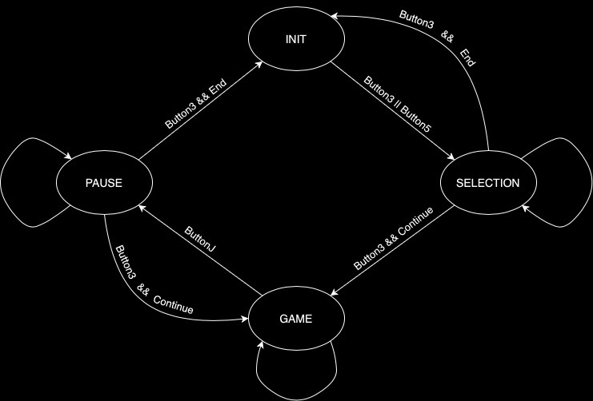

# <strong> Bluetooth Controller </strong>

The goal of the project is to create a bluetooth controller that allows us to play 
a computer game using a joystick or an accelerometer.  
In our case we are playing Super Mario, but with a couple of adjustments in the code 
we can potentially play any game that can run on python. 

# <strong> Table of Contents </strong>
1. <a href="#requirementslist">Requirements</a> 
&nbsp;&nbsp;&nbsp;&nbsp; 1.1 <a href="#hwrequirements">Hardware Requirements</a> 
&nbsp;&nbsp;&nbsp;&nbsp; 1.2 <a href="#swrequirements">Software Requirements</a> 
2. <a href="#layoutlist">Project Layout</a> 
3. <a href="#startlist">Getting Started</a> 
&nbsp;&nbsp;&nbsp;&nbsp; 3.1 <a href="#hwsetup">Hardware Setup</a> 
&nbsp;&nbsp;&nbsp;&nbsp; 3.2 <a href="#swsetup">Software Setup</a> 
4. <a href="#codelist">Code Highlights</a> 
&nbsp;&nbsp;&nbsp;&nbsp; 4.1 <a href="#ccsfsm">CCS FSM</a> 
&nbsp;&nbsp;&nbsp;&nbsp; 4.2 <a href="#pythonadd">Python Additions</a> 
5. <a href="#externalslist">Video and Presentation</a> 
6. <a href="#teamlist">Team Members</a> 
7. <a href="#referencelist">References</a> 

# <strong> Requirements </strong> 

## Hardware Requirements

- [MSP432P401R](https://www.ti.com/lit/ds/slas826e/slas826e.pdf): which is the main board that process all the data;
- [Educational booster pack MKII](https://www.ti.com/tool/BOOSTXL-EDUMKII?keyMatch=&tisearch=search-everything&usecase=hardware): which is the board with an LCD screen, a joystick, 
buttons and the accelerometer that will act as the controller;
- [ESP32](https://www.amazon.it/AZDelivery-NodeMCU-Development-Arduino-gratuito/dp/B071P98VTG/ref=asc_df_B071P98VTG/?tag=googshopit-21&linkCode=df0&hvadid=194881236129&hvpos=&hvnetw=g&hvrand=2149836172945902890&hvpone=&hvptwo=&hvqmt=&hvdev=c&hvdvcmdl=&hvlocint=&hvlocphy=1008827&hvtargid=pla-367709801435&th=1): which is the board able to output the bluetooth signal to the main computer;
- A power-bank to allow a stable power supply to the two boards;
- 3 jumper wires, and eventually a breadboard to make more efficient connections;
- A computer with a serial bluetooth port.

## Software Requirements

- Arduino to program the ESP32; 
- CCS to run the MSP code;
- An IDE with Python updated to Python-3.10.7 version;
- Some libraries that are going to be included in the README <a href="#swsetup">later.</a> 

# <strong> Project Layout </strong> 

<pre><code>Mario_bluetooth_controller
├── Mario-Level-1-master            # Python super Mario related files
│	├── data                            # Files that run the actual game
│	├── resources                       # Files that manages game sound and graphics
│	└── mario_level_1.py                # Converts BT inputs into keyboard commands
├── bluetooth_controller            # CCS related files
│	├── LcdDriver                       # LCD driver lib
│	├── constants.c(.h)                 # Gathers all the constants
│	├── functions.c(.h)                 # Gathers all the functions
│	├── images.c(.h)                    # Contains the 3 LCD images
│	├── main.c                          # Main code
│	├── setup.c(.h)                     # Initializes HW, ADC, Clock, UART and LCD
│	└── stateMachine.c(.h)              # Contains the state machine functions
├── readme_img                      # Gathers the images needed for the readme
│	├── Board_back.jpg                  # Front picture of the builded project
│	├── Board_front.jpg                 # Picture of the connections between the boards
│	└── FSM_scheme.jpg                  # Layout of the FSM
├── README.md                       # Readme file
└── UART_to_BT.ino                  # Code to program the ESP32 
</code></pre>

<a href="#index">index</a>

# <strong> Getting Started </strong>

## Hardware setup

- Attach the 2 boards paying attention to the pin order;
- Connect as shown the main board to the power supply and to the ESP32 (after programming it).

## Software setup

- First of all program the ESP32 with the Arduino code, in order to do it be sure to have the following libraries: HardwareSerial and BluetoothSerial;
- Plug the MSP432 to the computer and program it via CCS, make sure to install properly the DriverLib;
- Open the Python code, install the following libraries (threading, serial, pynput, pygame), launch the game and be ready to play.

<a href="#index">index</a>

# <strong> Code Highlights Explanation </strong>

## CCS FSM

The following image represents the main structure of the core FSM that controls the various stages of the game: 

INIT: Initial state of the FSM, here the LCD screen displays the initial menu with the sentence "press a button to start". To exit this state you have to press either buttons on the board; 

SELECTION: In this stage you are in the first selection menu, you can decide to play either with the joystick or the accelerometer. To exit this phase you can select the exit option or the continue option; 

GAME: This is the stage where you are actually playing the game, while the LCD screen displays a static image of Mario. To exit this phase you have to press the joystick button to enter the pause menu;

PAUSE: A very similar stage to the selection menu, you can again decide to exit/continue playing or also change the gamemode (from acc to joystick or vice versa).  

<a href="#index">index</a>

## Python Additions

We decided to create a one-hot encoding to differentiate the various inputs that the controller can transmit to the computer.

<pre><code>bit0 = 0b00000001       #bit0 action
bit1 = 0b00000010       #bit1 jump
bit2 = 0b00000100       #bit2 left
bit3 = 0b00001000       #bit3 right
bit4 = 0b00010000       #bit4 down
bit5 = 0b00100000       #bit5 up
bit6 = 0b01000000       #bit6 pause
bit7 = 0b10000000       #bit7 quit
</code></pre>

Through the code below, we are able to receive inputs via bluetooth and consequently emulate the pressure of the keyboard keys based on the value of the signal we receive.

<pre><code>def thread_button(bt,keyboard):
    while True:
        #read data from Bluetooth
        data = int.from_bytes(bt.read(1),'big')

        #action
        if(data & c.bit0):
            keyboard.press('s')
        else :
            keyboard.release('s')  
        
        #same thing for "jump, left, right, down and up" inputs

        #pause
            #bit_6 toggle to 1 only when the state changes
        if((data & c.bit6) and not previous_bit_6):
            if(not c.isPauseTime):
                keyboard.press(Key.esc)
                c.isPauseTime = True
            else :
                keyboard.press(Key.enter)
                c.isPauseTime = False
        else :
            keyboard.release(Key.esc)
            keyboard.release(Key.enter)

        #quit
            #bit_7 toggle to 1 only when the quit selection is confirmed on the controller
        if((data & c.bit7) and not previous_bit_7):
            bt.close()
            keyboard.press(Key.alt)
            keyboard.press(Key.f4)
        else :
            keyboard.release(Key.alt)
            keyboard.release(Key.f4)

        previous_bit_6 = data & c.bit6
        previous_bit_7 = data & c.bit7</code></pre>  

<a href="#index">index</a>

# <strong> Video and Presentation </strong>

[Presentation slides](https://docs.google.com/presentation/d/1Qpzy2kaDjex3hpwY10Ic5bjc5NFrYW04lYs_KVzTvvE/edit#slide=id.g2042e0ed896_0_313) 

[YouTube demo video](https://www.youtube.com/watch?v=4A2qw3KP-wk)

# <strong> Team Members </strong>

The project was carried out by the collaboration of 3 people, mainly the work was made in common,  
in particular then each member took care of a specific part:

Giuseppe Webber: ADC configuration

Giovanni Solfa: Python code

Alessandro Gianluca Cazzaniga: LCD screen

# <strong> References </strong>

We didn't create Mario's level from scratch, but we took [this github project](https://github.com/justinmeister/Mario-Level-1) and modified a couple of things to be able to receive inputs via bluetooth. 

We also used [this website](https://notisrac.github.io/FileToCArray/) to create the images used in the different LCD screens.

<a href="#index">index</a>

