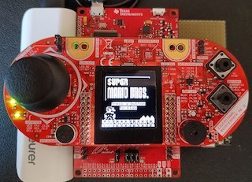
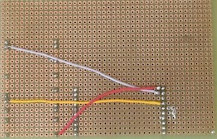

# <strong> Bluetooth Controller </strong>

The goal of the project is to create a bluetooth controller that allows us to play 
a computer game using a joystick or an accelerometer.  
In our case we are playing Super Mario, but with a couple of adjustments in the code 
we can potentially play any game that can run on python. 

# <strong> Table of Contents </strong>
1. <a href="#requirementslist">Requirements</a> 
&nbsp;&nbsp;&nbsp;&nbsp; 1.1 <a href="#hwrequirements">Hardware Requirements</a> 
&nbsp;&nbsp;&nbsp;&nbsp; 1.2 <a href="#swrequirements">Software Requirements</a> 
2. <a href="#layoutlist">Project Layout</a> 
3. <a href="#startlist">Getting Started</a> 
&nbsp;&nbsp;&nbsp;&nbsp; 3.1 <a href="#hwsetup">Hardware Setup</a> 
&nbsp;&nbsp;&nbsp;&nbsp; 3.2 <a href="#swsetup">Software Setup</a> 
4. <a href="#codelist">Code Highlights</a> 
&nbsp;&nbsp;&nbsp;&nbsp; 4.1 <a href="#ccsfsm">Ccs FSM</a> 
&nbsp;&nbsp;&nbsp;&nbsp; 4.2 <a href="#pythonadd">Python Additions</a> 
5. <a href="#externalslist">Video and Presentation</a> 
6. <a href="#teamlist">Team Members</a> 
7. <a href="#referencelist">References</a> 

# <strong> Requirements </strong> 

## Hardware Requirements

- [MSP432P401R](non trovo il link della Texas per la nostra scheda): which is the main board that process all the data;
- [Educational booster pack MKII](https://www.ti.com/tool/BOOSTXL-EDUMKII?keyMatch=&tisearch=search-everything&usecase=hardware): which is the board with an LCD screen, a joystick, 
buttons and the accelerometer that will act as the controller;
- [ESP32](https://www.amazon.it/AZDelivery-NodeMCU-Development-Arduino-gratuito/dp/B071P98VTG/ref=asc_df_B071P98VTG/?tag=googshopit-21&linkCode=df0&hvadid=194881236129&hvpos=&hvnetw=g&hvrand=2149836172945902890&hvpone=&hvptwo=&hvqmt=&hvdev=c&hvdvcmdl=&hvlocint=&hvlocphy=1008827&hvtargid=pla-367709801435&th=1): which is the board able to output the bluetooth signal to the main computer;
- Either a power-bank or a battery plus a 5V power module to allow a stable power supply to the two boards;
- 3 jumper wires, and eventually a breadboard to make more efficient connections;
- A computer with a serial bluetooth port.

## Software Requirements

- Arduino to program the ESP32; 
- CCS to run the MSP code;
- An IDE with Python updated to pi-3.10.7 version;
- Some libraries that are going to be included in the README later.

# <strong> Project Layout </strong> 

<pre><code>Mario_bluetooth_controller
├── Mario-Level-1-master            # Python super Mario related files
│	├── data                            # Files that run the actual game
│	├── resources                       # Files that manages game sound and graphics
│	└── mario_level_1.py                # Converts BT inputs into keyboard commands
├── bluetooth_controller            # CCS related files
│	├── LcdDriver                       # LCD driver lib
│	├── constants.c(.h)                 # Gathers all the constants
│	├── functions.c(.h)                 # Gathers all the functions
│	├── images.c(.h)                    # Contains the 3 LCD images
│	├── main.c                          # Main code
│	├── setup.c(.h)                     # Initializes HW, ADC, Clock, UART and LCD
│	└── stateMachine.c(.h)              # Contains the state machine functions
├── readme_img                      # Gathers the images needed for the readme
│	├── Board_back.jpg                  # Front picture of the builded project
│	├── Board_front.jpg                 # Picture of the connections between the boards
│	└── FSM_scheme.jpg                  # Layout of the FSM
├── README.md                       # Readme file
└── UART_to_BT.ino                  # Code to program the ESP32 

</code></pre>

# <strong> Getting Started </strong>

## Hardware setup

- Attach the 2 boards paying attention to the pin order;
- Connect as shown the main board to the power supply and to the ESP32 (after programming it).

## Software setup

- First of all program the ESP32 with the Arduino code, in order to do it be sure to have (libraries);
- Plug the MSP432 to the computer and program it via CCS, be sure to have (libraries);
- Open the Python code, install the following libraries (), launch the game and be ready to play.

# <strong> Code Highlights Explanation </strong>

## Ccs FSM

## Python Additions

We decided to create a one-hot encoding to differentiate the various inputs that the user can transmit to the game.

<pre><code>bit0 = 0b00000001       #bit0 action
bit1 = 0b00000010       #bit1 jump
bit2 = 0b00000100       #bit2 left
bit3 = 0b00001000       #bit3 right
bit4 = 0b00010000       #bit4 down
bit5 = 0b00100000       #bit5 up
bit6 = 0b01000000       #bit6 pause
bit7 = 0b10000000       #bit7 quit
</code></pre>

Through the code below, we are able to receive inputs via bluetooth and consequently emulate the pressure of the keyboard keys based on the value of the signal we receive.

<pre><code>def thread_button(bt,keyboard):
    while True:
        #read data from Bluetooth
        data = int.from_bytes(bt.read(1),'big')

        #action
        if(data & c.bit0):
            keyboard.press('s')
        else :
            keyboard.release('s')  
        
        #same thing for "jump, left, right, down and up" inputs

        #pause
            #bit_6 toggle to 1 only when the state changes
        if((data & c.bit6) and not previous_bit_6):
            if(not c.isPauseTime):
                keyboard.press(Key.esc)
                c.isPauseTime = True
            else :
                keyboard.press(Key.enter)
                c.isPauseTime = False
        else :
            keyboard.release(Key.esc)
            keyboard.release(Key.enter)

        #quit
            #bit_7 toggle to 1 only when the quit selection is confermed on the controller
        if((data & c.bit7) and not previous_bit_7):
            bt.close()
            keyboard.press(Key.alt)
            keyboard.press(Key.f4)
        else :
            keyboard.release(Key.alt)
            keyboard.release(Key.f4)

        previous_bit_6 = data & c.bit6
        previous_bit_7 = data & c.bit7</code></pre>  

# <strong> Video and Presentation </strong>

[Presentation slides](inserire link pp google) 

[YouTube demo video](inserire link yt)

# <strong> Team Members </strong>

The project was carried out by the collaboration of 3 people, mainly the work was made in common; 
in particular then each member took care of a specific part:

Giuseppe Webber:

Givanni Solfa:

Alessandro Gianluca Cazzaniga:

# <strong> References </strong>

We didn't create Mario's level from scratch, but we took [this github project](https://github.com/justinmeister/Mario-Level-1) and modified a couple of things to be able to receive inputs via bluetooth.

